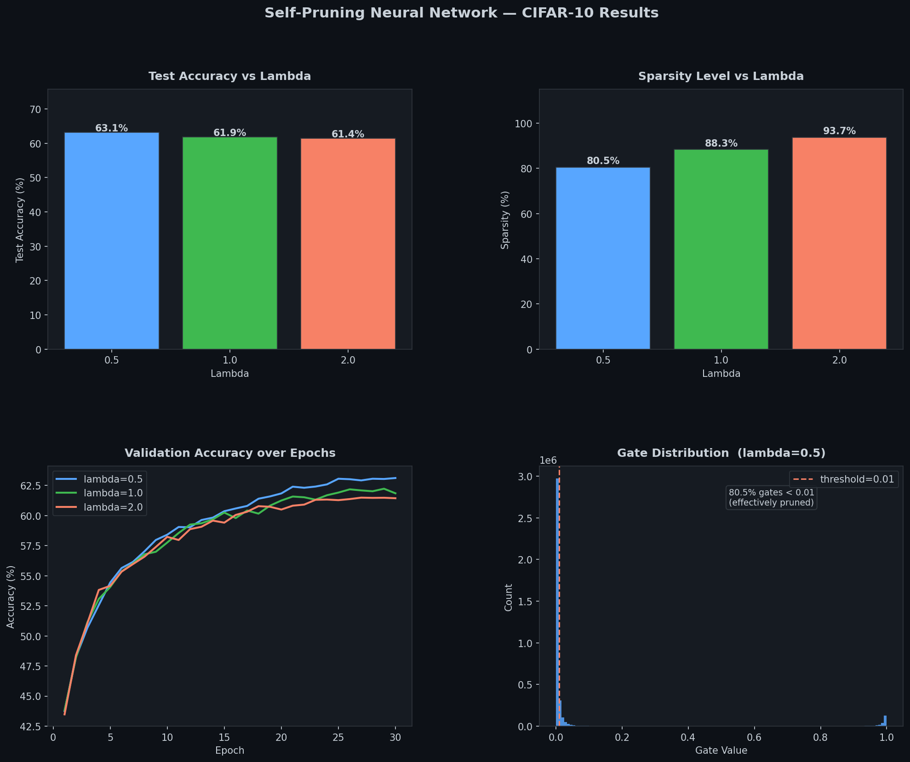

# Self-Pruning Neural Network — CIFAR-10

A feed-forward neural network that **learns to prune its own weights during training** using learnable sigmoid gates and L1 sparsity regularization. No post-training pruning step needed.

---

## How It Works

Every weight `w_ij` has a learnable gate score `s_ij`. During the forward pass:

```
gates         = sigmoid(gate_scores)     in (0, 1)
pruned_weight = weight * gates           element-wise
output        = x @ pruned_weight.T + bias
```

Total training loss:

```
Total Loss = CrossEntropyLoss  +  lambda * mean(sigmoid(gate_scores))
```

The L1 mean term applies a **constant gradient of -lambda** to every gate. Unimportant weights can't push back — their gates collapse to 0 (pruned). Important weights generate a large classifier gradient that holds their gates open.

### Critical design: dual optimizers

Gate scores use a **separate Adam optimizer with lr=0.1** (vs lr=1e-3 for weights). This ensures the sparsity gradient is strong enough to close unimportant gates while the classifier still holds important ones open.

---

## Architecture

```
Input (32x32x3)
  -> Flatten -> 3072
  -> PrunableLinear(3072 -> 1024) -> BatchNorm -> ReLU
  -> PrunableLinear(1024 ->  512) -> BatchNorm -> ReLU
  -> PrunableLinear( 512 ->  256) -> BatchNorm -> ReLU
  -> PrunableLinear( 256 ->   10) -> logits

Total gate parameters: 3,803,648
```

---

CIFAR-10 downloads automatically (~170 MB). Runtime: ~30 min on GPU.

---

## Results

| Lambda | Test Accuracy | Sparsity (%) | Pruned Gates       |
|:------:|:-------------:|:------------:|:------------------:|
| 0.5    | **63.12%**    | 80.53%       | 3,063,154 / 3,803,648 |
| 1.0    | 61.85%        | 88.33%       | 3,359,908 / 3,803,648 |
| 2.0    | 61.44%        | **93.69%**   | 3,563,814 / 3,803,648 |

**Key finding:** At lambda=2.0, over 93% of weights are pruned with only a 1.7% accuracy drop vs lambda=0.5. The network retains competitive performance at a fraction of its original capacity.



---

## Why L1 on Sigmoid Gates Causes Sparsity

| Penalty | Gradient near zero | Effect |
|:-------:|:-----------------:|:------:|
| L1: `sum(gates)` | Constant = -lambda | Gates driven all the way to 0 — true pruning |
| L2: `sum(gates²)` | Shrinks toward 0 | Gates stall at a small positive value |

L1 is equivalent to LASSO regularization — the same reason it produces exact zeros while ridge regression does not. The loss uses `.mean()` (not `.sum()`) so lambda is a per-gate penalty independent of network size.

---

## Files

| File | Description |
|------|-------------|
| `Self_Pruning.ipynb` | Full solution: `PrunableLinear`, network, dual-optimizer training loop, plots |
| `report.md` | Written analysis with results and sparsity explanation |
| `requirements.txt` | Python dependencies |
| `pruning_results.png` | Output plot — accuracy, sparsity, gate distribution |
